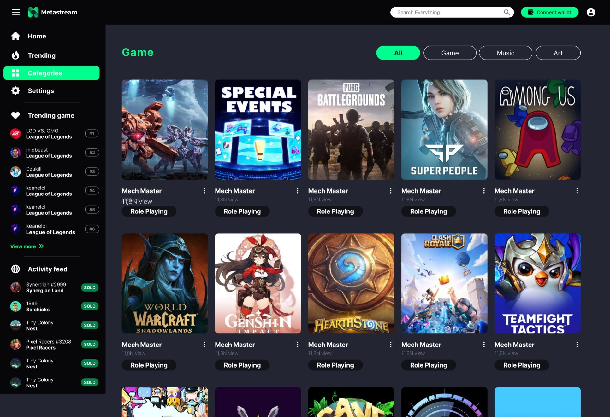

###  Software Engineer at Metastream Labs Inc

Metastream is a Streaming-focused Game NFT Marketplace. Combines the best of Game entertainment and Defi. No boundaries, no hassle, pure entertainment and enhanced gamer benefits.

       

### Games Published

  
  <a target="_blank" href="https://stun-store.vercel.app">

 ### Connect to Me

  
  

